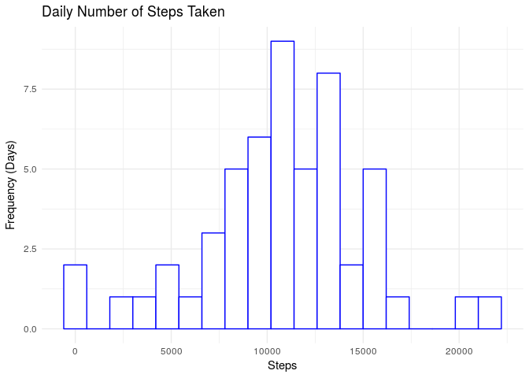
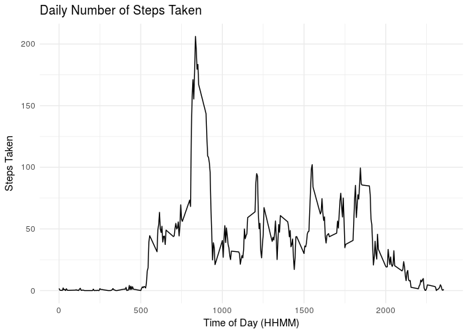
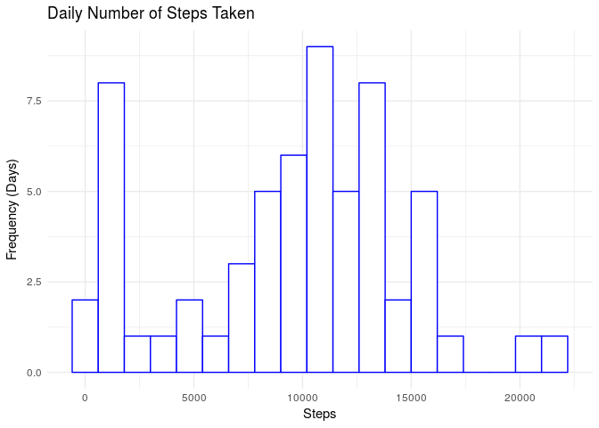
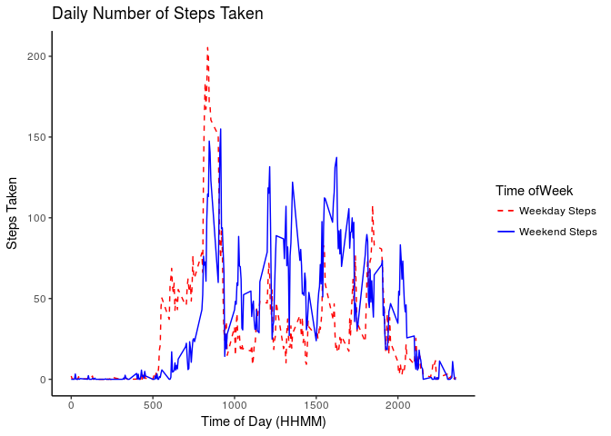
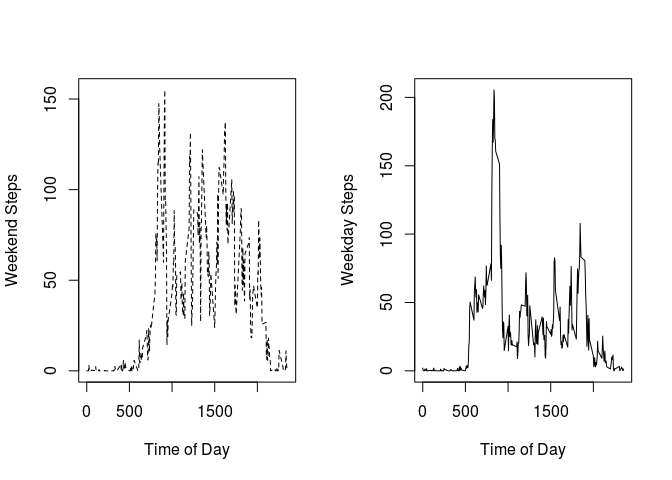

# Reproducible Research: Peer Assessment 1


## Loading and preprocessing the data

```r
library(ggplot2)
data <- read.csv('activity.csv')
aggdata <- aggregate(steps~date, data, FUN=sum, na.rm=TRUE)
```


## What is mean total number of steps taken per day?

###First get a histogram of the data to give an idea of where the median is, and then compute explicitly.


```r
myplot <-ggplot(aggdata, aes(x=steps))
myplot<- myplot+ geom_histogram(binwidth=1200, col='blue', fill='white')
myplot <- myplot + labs(title="Daily Number of Steps Taken", x="Steps", y="Frequency (Days)")
myplot <- myplot +theme_minimal()
myplot
```

<!-- -->

###With my binning choice, the mean and median appear to be in the range [10,000, 11,000].

```r
datmean <- mean(aggdata$steps, na.rm=TRUE)
datmed <- median(aggdata$steps, na.rm=TRUE)
datmean
```

```
## [1] 10766.19
```

```r
datmed
```

```
## [1] 10765
```

## What is the average daily activity pattern?

###Aggregate the data again, but use FUN=mean

```r
aggdata <- aggregate(steps~interval, data, FUN=mean, na.rm=TRUE)
myplot<- ggplot(aggdata, aes(x=interval, y=steps)) +geom_line()
myplot <- myplot +theme_minimal()
myplot <- myplot + labs(title="Daily Number of Steps Taken", x="Time of Day (HHMM)", y="Steps Taken")
myplot
```

<!-- -->

###This person on average took the most steps sometime near 8AM.


```r
mostactive <- aggdata$interval[which.max(aggdata$steps)]
mostactive
```

```
## [1] 835
```

## Imputing missing values

### Ignoring NA values introduces some bias into the dataset because the person was likely still somewhat active during those times that the measurement failed.  A simple strategy for inferring where the missing values lie is to determine the median for that time interval.


###Get the number of rows that need to have an NA replaced.  There are 2304 NA values to replace.  


```r
summary(data)
```

```
##      steps                date          interval     
##  Min.   :  0.00   2012-10-01:  288   Min.   :   0.0  
##  1st Qu.:  0.00   2012-10-02:  288   1st Qu.: 588.8  
##  Median :  0.00   2012-10-03:  288   Median :1177.5  
##  Mean   : 37.38   2012-10-04:  288   Mean   :1177.5  
##  3rd Qu.: 12.00   2012-10-05:  288   3rd Qu.:1766.2  
##  Max.   :806.00   2012-10-06:  288   Max.   :2355.0  
##  NA's   :2304     (Other)   :15840
```

### Use tapply to replace the NAs


```r
mynas <- is.na(data$steps)
avg_interval <- tapply(data$steps, data$interval, median, na.rm=TRUE, simplify=TRUE)
data$steps[mynas] <-avg_interval[as.character(data$interval[mynas])]
aggdata <- aggregate(steps~date, data, FUN=sum, na.rm=TRUE)
newmean <- mean(aggdata$steps)
newmean
```

```
## [1] 9503.869
```

```r
newmedian <- median(aggdata$steps)
newmedian
```

```
## [1] 10395
```

```r
myplot <-ggplot(aggdata, aes(x=steps))
myplot<- myplot+ geom_histogram(binwidth=1200, col='blue', fill='white')
myplot <- myplot + labs(title="Daily Number of Steps Taken", x="Steps", y="Frequency (Days)")
myplot <- myplot +theme_minimal()
myplot
```

<!-- -->

```r
aggdata <- aggregate(steps~interval, data, FUN=mean, na.rm=TRUE)
myplot<- ggplot(aggdata, aes(x=interval, y=steps)) +geom_line()
myplot <- myplot +theme_minimal()
myplot <- myplot + labs(title="Daily Number of Steps Taken", x="Time of Day (HHMM)", y="Steps Taken")
myplot
```

<!-- -->

```r
mostactive <- aggdata$interval[which.max(aggdata$steps)]
mostactive
```

```
## [1] 835
```

## Are there differences in activity patterns between weekdays and weekends?


```r
data$day_of_week <- weekdays(as.Date(data$date))
weekend_days <- c("Saturday", "Sunday")
data$day_type <- ifelse(data$day_of_week %in% weekend_days, "Weekend", "Weekday")
weekend_data <- subset(data, data$day_type == "Weekend")
head(weekend_data)
```

```
##      steps       date interval day_of_week day_type
## 1441     0 2012-10-06        0    Saturday  Weekend
## 1442     0 2012-10-06        5    Saturday  Weekend
## 1443     0 2012-10-06       10    Saturday  Weekend
## 1444     0 2012-10-06       15    Saturday  Weekend
## 1445     0 2012-10-06       20    Saturday  Weekend
## 1446     0 2012-10-06       25    Saturday  Weekend
```

```r
weekday_data <- subset(data, data$day_type == "Weekday")
we_agg <- aggregate(steps~date, weekend_data, FUN=sum, na.rm=TRUE)
wd_agg <- aggregate(steps~date, weekday_data, FUN=sum, na.rm=TRUE)
mean(we_agg$steps)
```

```
## [1] 10998.38
```

```r
mean(wd_agg$steps)
```

```
## [1] 8972.489
```

```r
we_agg <- aggregate(steps~interval, weekend_data, FUN=mean, na.rm=TRUE)
wd_agg <- aggregate(steps~interval, weekday_data, FUN=mean, na.rm=TRUE)
# Combine data frames
colnames(we_agg)[2] <- "Weekend_Steps"
colnames(wd_agg)[2] <- "Weekday_Steps"
plotframe <- merge(wd_agg, we_agg, by='interval')
#And plot the two time series on the same plot in order to compare
#Activity at different times of the week.  
myplot<- ggplot(plotframe, aes(interval, y=value, color="Time of Week")) 
myplot <- myplot +geom_line(aes(y=Weekday_Steps, col="Weekday Steps"), linetype='dashed')
myplot <- myplot +geom_line(aes(y = Weekend_Steps, col="Weekend Steps"), linetype='solid')
myplot <- myplot + scale_color_manual(values = c('red', 'blue'))
myplot <- myplot + scale_linetype_manual(values = c('dashed','solid'))
myplot <- myplot +theme_classic()
myplot <- myplot + guides(colour=guide_legend(override.aes=list(linetype=c(2,1))))
myplot <- myplot + labs(title="Daily Number of Steps Taken", x="Time of Day (HHMM)", y="Steps Taken", color = "Time ofWeek")
myplot
```

<!-- -->

```r
#or if you prefer a multi-panel plot
par(mfrow=c(1,2))
plot(plotframe$interval, plotframe$Weekend_Steps,lty=2, type='l', xlab="Time of Day", ylab="Weekend Steps")
plot(plotframe$interval, plotframe$Weekday_Steps, lty=1, type='l', xlab="Time of Day", ylab="Weekday Steps")
```

<!-- -->
